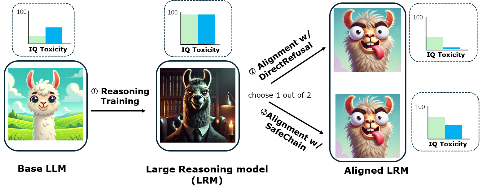
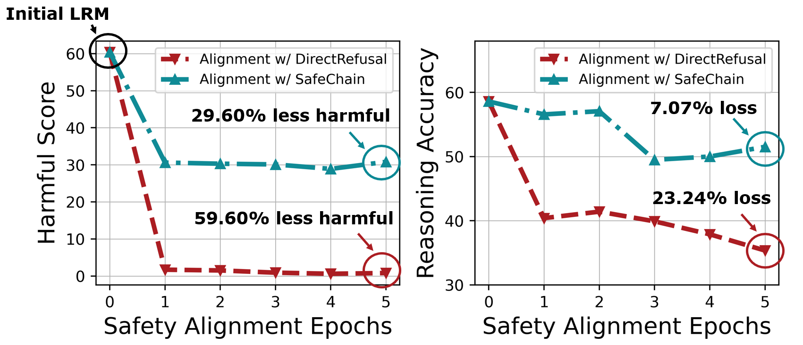

<h1 align="center">	Safety Tax: Safety Alignment Makes Your Large Reasoning Models  Less Reasonable</h1>

<div align="center">


[](https://badges.pufler.dev/visits/git-disl/Safety-Tax)


</div>

[[`📕 Paper`](https://arxiv.org/abs/2503.00555)] [[`🤗 DirectRefusal`](https://huggingface.co/datasets/TianshengHuang/DirectRefusal)] [[`🤗 SafeChain Aligned model`](https://huggingface.co/TianshengHuang/s1_sft_cot)]  [[`🤗 DirectRefusal Aligned model`](https://huggingface.co/TianshengHuang/s1_sft_sft)]


## Aligned LRM production pipeline 
A two-stage sequential pipelin is considered. 
1. **Reasoning training.**. At this stage, we  supervised fine-tune(SFT) the model on reasoning dataset (e.g., s1k) to produce the Large Reasoning Model (LRM).
2. **Safety alignment**. At this stage, we SFT the model on safety dataset (e.g., SafeChain, DirectRefusal) to safety aligned the LRM. 

<div align="center">
  
</div>


## Safety Tax

We identify an important tradeoff at the safety alignment stage. Pariticularly, Safety alignment can restore the safety of the LRM (smaller harmful score). However, this come with a cost of degrading the model reasoning ability (smaller reasoing accuracy). You can't get a safety aligned model and good reasoning model at the same time! The phenomenon is named **Safety Tax**. 

<div align="center">
  
</div>

## Preparation

1. Install the required packages. 
```
conda create --name s1k python=3.12.0
source activate s1k
pip install -r requirements.txt
```

2. Install the evaluation benchmark lm_eval. 

```
cd eval/lm-evaluation-harness
pip install -e .[math,vllm]
```

3. All the datasets have already been processed and uploaded to Huggingface. So no worry about the datasets! But we do provide a python script  to produce the dataset to your own huggingface repo. Checkout the directory `/data`.  

4. Some models (e.g., Llama) need permission to access. When they said you don't have permission, apply one in their huggingface page. After applying permission, you should be able to access the model, but you first need to enter your token in the file `huggingface_token.txt`.

5. Please enter your OPENAI key and the huggingface key in the the scripts in `script/safety_alignment`. Lm-Eval framework need to use GPT4o API to evaluate the results.  


## Command to reproduce results
All the scripts are avaialble in `script/safety_alignment`. We recommend to use Slurm to reproduce the results as the logging file will be automatically organized into the script directory (if you don't use Slurm, just replace sbatch with bash in our example). 

With the following commands you can reproduce all the results. Note, we use 8xH200, if you don't have 8 GPUs, you may change the gpu number in the scripts. 

s1.1-32B
```
sbatch sft.sh TianshengHuang/s1k 
sbatch sft_cot.sh TianshengHuang/s1k 
sbatch original.sh TianshengHuang/s1k 
```

DeepSeek32B
```
sbatch sft.sh deepseek-ai/DeepSeek-R1-Distill-Qwen-32B
sbatch sft_cot.sh deepseek-ai/DeepSeek-R1-Distill-Qwen-32B
sbatch original.sh deepseek-ai/DeepSeek-R1-Distill-Qwen-32B
```

LIMO
```
sbatch sft.sh GAIR/LIMO
sbatch sft_cot.sh GAIR/LIMO
sbatch original.sh GAIR/LIMO
```

Epochs experiments (for producing the thumb pic)
```
sbatch sft.sh TianshengHuang/s1k 1
sbatch sft.sh TianshengHuang/s1k 2
sbatch sft.sh TianshengHuang/s1k 3
sbatch sft.sh TianshengHuang/s1k 4
```


## Acknowledgment
The repo is built upon the code base from  [simplescaling
s1](https://github.com/simplescaling/s1). Special thanks to simplesacling team! 

## Citation

@misc{huang2025safetytax,
      title={Safety Tax: Safety Alignment Makes Your Large Reasoning Models Less Reasonable}, 
      author={Tiansheng Huang and Sihao Hu and Fatih Ilhan and Selim Furkan Tekin and Zachary Yahn and Yichang Xu and Ling Liu},
      year={2025},
      eprint={2503.00555},
      archivePrefix={arXiv},
      primaryClass={cs.CR},
      url={https://arxiv.org/abs/2503.00555}, 
}